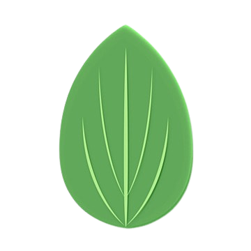

# Passionate About the Art of Programming 🚀

I'm Ashraf, a self-motivated web developer with a strong passion for the [MERN](# "MongoDB, Express, React, Node.js") stack . With an ever-curious mind, I'm always exploring new technologies to enhance my programming skills and build exciting applications.

---

 ## 🎯 My Dev Skills 

 ####   HTML 
 
 ####  CSS 

 | Know/Using   | Learning Path      |
 |------------- | -------------  |
 | - Bootstrap   | - Material Ui  |
 | - Tailwind  | - Chakra Ui  |
 | - Material-tailwind  |    |

####   JAVASCRIPT

| Know/Using   | Learning Path   |
 |------------- | -------------  |
 | - React     | - NextJs       |
 | - TypeScript | - Testing      |

####   NODE Js
 | Know/Using   
 |-------------
 | -Express Js
 

####   MongoDb, Mongoose
 
 
 **Social Links**
---

